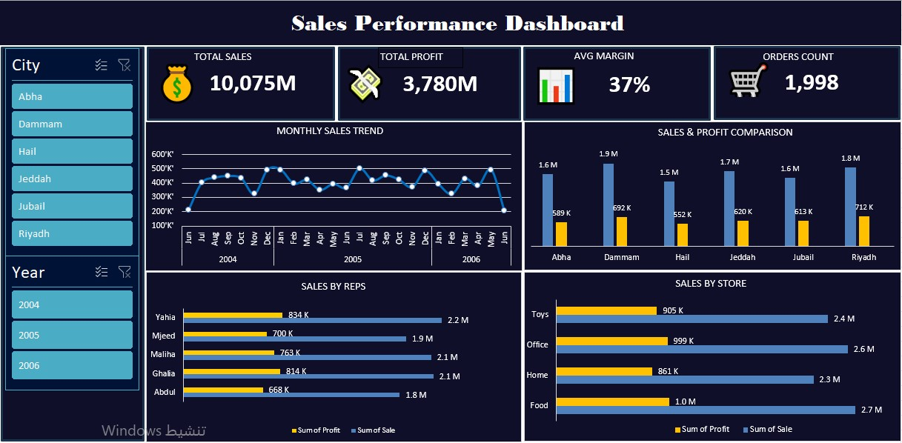
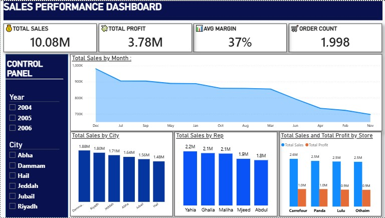
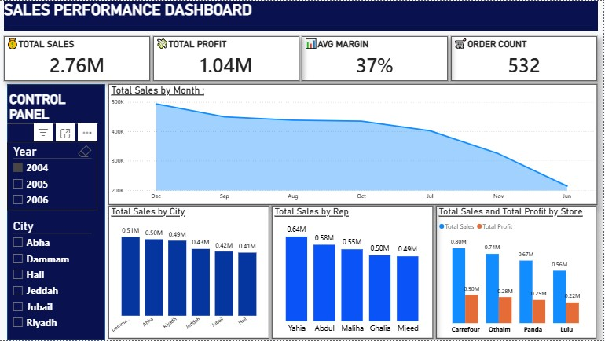
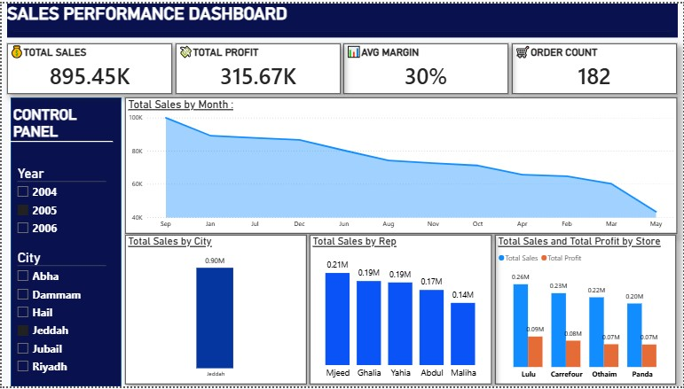

# retail-sales-business-intelligence-

📊 This project walks through a complete sales analysis workflow for a retail dataset spanning 2004–2006, using four different tools to cover the full pipeline — from data cleaning to final reporting.
Excel and Power BI handle the dashboarding and reporting layer, Python takes care of data cleaning and deeper exploratory analysis, and SQL Server powers the underlying queries that drive the regional and rep-level insights.

---

### 1️⃣ Excel Dashboard 📈

The Excel dashboard presents the full three-year sales performance (2004–2006) in a clean, low-fatigue dark theme. Interactive slicers filter by city and year, while the main panel tracks total sales, profit, margin, and order count — landing at SAR 10.08M in sales, SAR 3.78M in profit, a 37% margin, and 1,998 orders. The city comparison highlights Riyadh and Dammam as the strongest contributors, while Food and Office drive the highest sales volume.

---

### 2️⃣ Power BI ⚡

#### Macro Cross-Year Overview:

The unfiltered view mirrors the Excel totals — SAR 10.08M in sales, SAR 3.78M in profit, 37% margin, 1,998 orders — with Yahia as the top rep (SAR 2.2M) and Carrefour as the top account (SAR 2.6M).

#### Fiscal Year 2004 Focus:

Filtering to 2004 alone narrows this to SAR 2.76M in sales and SAR 1.04M in profit across 532 orders, with Yahia and Carrefour still leading.

#### Jeddah Regional Hub Focus:

Filtering instead by region to Jeddah tells a different story: SAR 895.45K in sales and SAR 315.67K in profit at a lower 30% margin, with Mjeed as the top local rep and Lulu Hypermarket overtaking Carrefour as the top account in that market.

---

### 3️⃣ Python 🐍
The Python notebook (`Zainab_Python_Analysis.ipynb`) handles the data cleaning behind the dashboards — using pandas to fix inconsistent entries like “Mjeeed” to “Mjeed” and fill missing values. Plotly visualizations then explore the data further with a correlation heatmap, a sales-vs-profit scatter plot, and category distribution pies, revealing that Toys carry a stronger profit margin per unit than higher-volume categories like Food.

---

### 4️⃣ SQL Server 🗄️
The SQL script (`Zainab_SQL.sql`) builds the queries behind the regional and rep-level numbers: one ranks cities by profitability, one uses `RANK() OVER (PARTITION BY prod ORDER BY SUM(Sale) DESC)` to find the top rep per product category, and one uses `LAG()` to track month-over-month sales growth by city.

---
_🛡️ Maintained under the MIT License framework by Zainab._
